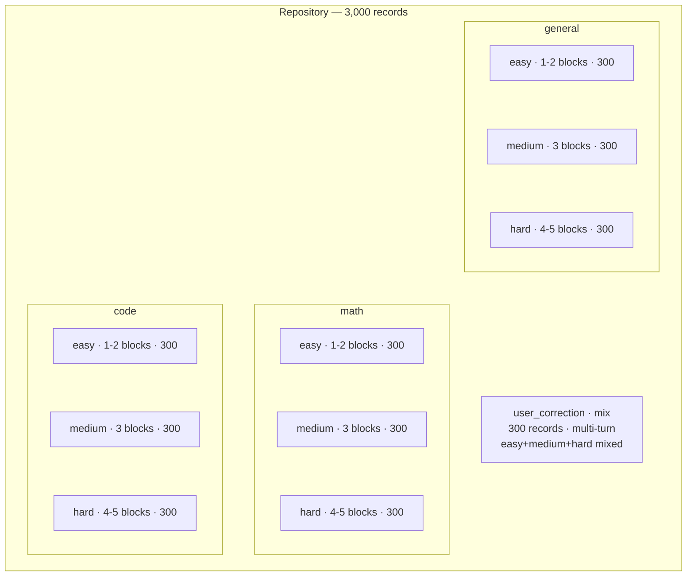
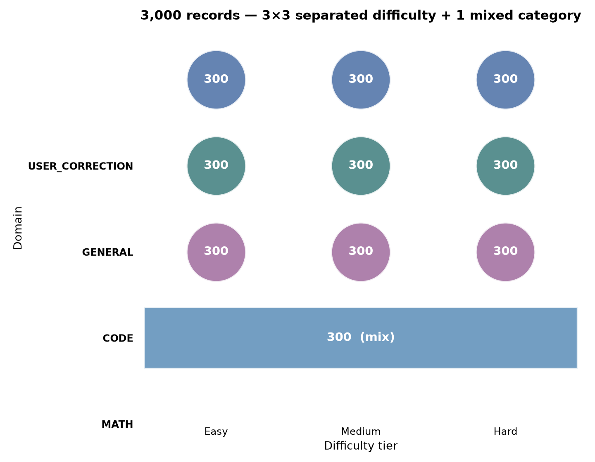
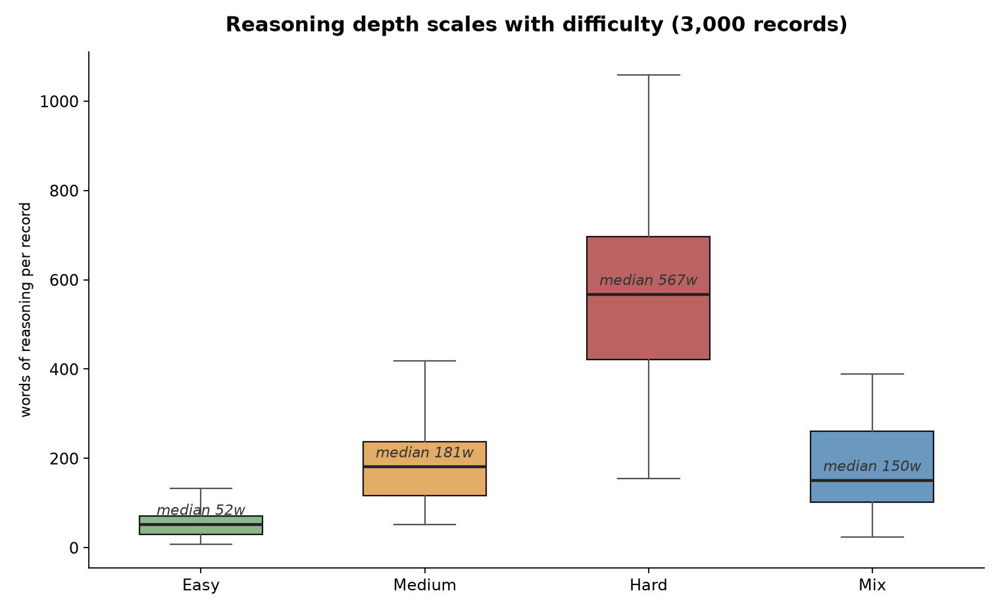
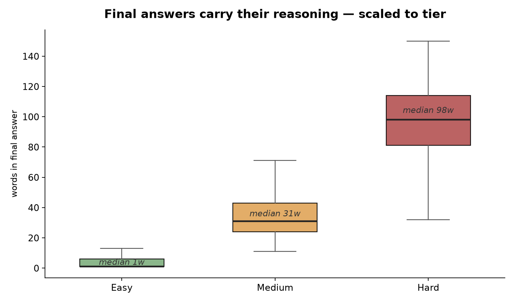
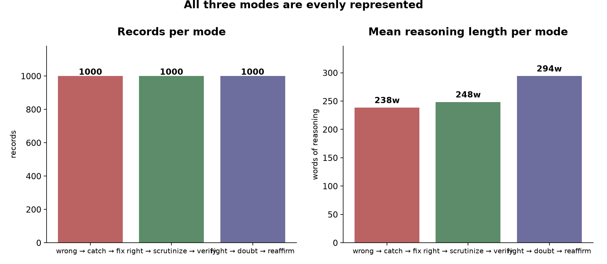
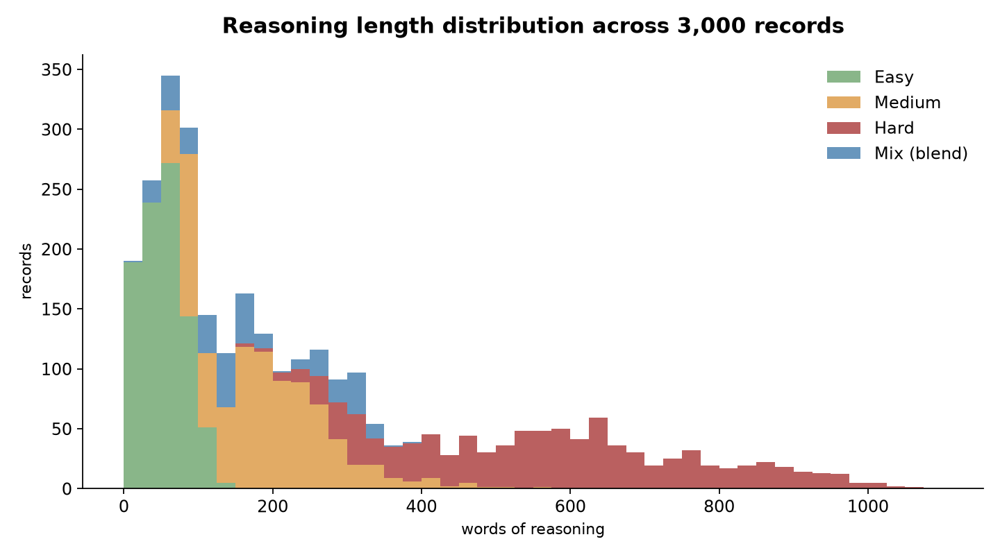

# Self Correction and Thinking

**A seed library for training language models to reason with self-correction.**


> Teaches three reasoning behaviors -- catching your own errors, verifying correct answers, and rejecting false doubts -- across four domains, three difficulty tiers, and three reasoning modes. Also includes multi-turn user-correction conversations where the user actively corrects or challenges the assistant.

---

## The structure at a glance



Every leaf folder holds exactly three files -- one per reasoning mode:

| File | Behavior pattern | What it teaches |
|------|------------------|-----------------|
| `wrong_then_fix.jsonl` | First attempt wrong → catch → fix → verify | You *can* be wrong, and a sanity check should catch it |
| `right_and_confirm.jsonl` | First attempt right → scrutinize → verify | Being right doesn't end the reasoning; proof matters |
| `right_doubt_reaffirm.jsonl` | First answer right → doubt with wrong alternative → reject the doubt | Second-guessing is itself fallible; don't manufacture errors |

The `user_correction/mix/` folder is the exception to the separated-difficulty structure: it contains a single folder of 300 multi-turn records with an even mix of easy (1-2 blocks), medium (3 blocks), and hard (4-5 blocks) -- 100 per mode file. These records teach the model how to respond to **external** corrections and challenges from a user, not just internal self-correction.

---

## Stats

| Property | Value |
|----------|-------|
| Records | **3,000** |
| Files | **30** (one per domain × tier × mode) |
| Records per file | exactly **100** |
| Domains | `math`, `code`, `general`, `user_correction` |
| Difficulty tiers | easy (1-2 blocks), medium (3 blocks), hard (4-5 blocks), mix (1-5 blocks) |
| Reasoning modes | wrong-then-fix, right-and-confirm, right-doubt-reaffirm |
| System prompts | ~30% of records (persona only, never instruction-gated) |
| Format | JSONL -- one JSON object per line |
| Validation | [`validate.py`](validate.py) -- strict structural gate |

### Thinking depth scales with problem difficulty

| Tier | Mean reasoning | Mean final answer | Blocks |
|------|---------------:|------------------:|:-----:|
| Easy | ~53 words | ~4 words | 1-2 |
| Medium | ~186 words | ~35 words | 3 |
| Hard | ~570 words | ~96 words | 4-5 |
| Mix | ~174 words | ~65 words | 1-5 |

Easy problems get a quick check. Hard problems get multiple rounds of catching, fixing, and verifying. The model learns to match effort to complexity instead of padding trivial answers or truncating hard ones. The mix row is the `user_correction` category, where each record is a four-message conversation and the totals reflect both assistant turns.

---

## The dataset, charted

Charts generated from the actual data by [`charts/generate_charts.py`](charts/generate_charts.py) -- rerun it any time the dataset changes.

**A cell for every combination of domain and tier** -- the three separated-difficulty domains form a 3×3 grid, and `user_correction` sits beneath as one wide mixed cell:



**Reasoning scales with difficulty** -- easy questions get a quick check, hard ones get multiple verification rounds, and the three separated tiers barely overlap. The blue `mix` band is `user_correction`, deliberately blended across all three depths:



**Final answers do the same** -- short for trivial questions, substantive for hard ones, with the mix category spanning the range:



**All three modes are evenly represented** -- 1,000 records each, comparable thinking depth:



**The reasoning-length distribution is trimodal at the separated tiers** -- easy, medium, and hard form distinct humps -- and the mix category (blue) spans across them, as its blend is designed to:



---

## The three reasoning modes

### `wrong_then_fix` -- learning to catch your own errors

```json
{"messages": [
  {"role": "user", "content": "What is 7 x 8?"},
  {"role": "assistant", "content": "imd\nFirst instinct: 54 (confused with 6x9).\nimb\n\n\nimd\nWait -- 7x8 is 56, not 54. Seven eights are fifty-six.\nimb\n\n56. I confused it with 6x9=54 initially."}
]}
```

A plausible mistake, a genuine catch, a corrected answer. This mode prevents overconfidence.

### `right_and_confirm` -- learning that verification isn't optional

The first answer is correct, then examined skeptically, then verified by a genuinely different method.

### `right_doubt_reaffirm` -- learning not to manufacture errors

The first answer is correct, then a tempting wrong second-guess appears, then the model recognizes the *doubt itself* was the error.

### `user_correction` -- learning to respond to external feedback

Multi-turn conversations where the **user** actively corrects or challenges the assistant:

```
user: "What is 5 x 5 if 5 is now 2?"
assistant: "5 x 5 becomes 2 x 5 = 10."
user: "no, the answer is 4. I said 5 is now 2, so it is 2 x 2"
assistant: (thinks about why the substitution was half-done) "4. You are right."
```

The model learns to **accept corrections gracefully** when it's wrong, **defend correct answers firmly** when the user is wrong, and **provide independent verification** when asked to double-check.

---

## Domains

- **[`math/`](src/math/README.md)** -- arithmetic, algebra, probability, combinatorics, number theory, geometry, calculus, sequences and series, optimization, Fermi estimation. From "What is 5 + 5?" to "Does the harmonic series diverge?"
- **[`code/`](src/code/README.md)** -- Python semantics, debugging, design patterns, algorithms, data structures, metaprogramming, concurrency, async. From `len("hello")` to descriptor protocols and the GIL.
- **[`general/`](src/general/README.md)** -- science reasoning (Olbers' paradox, tidal locking, square-cube law), logic (syllogisms, fallacies, knights and knaves), reading comprehension, causal reasoning, grammar, ethics, history, planning. Everything that isn't code or math.
- **[`user_correction/`](src/user_correction/mix/README.md)** -- multi-turn conversations where the user actively corrects, challenges, or asks to verify the assistant's answer. Mixed difficulty (easy + medium + hard in one folder).

---

## Format specification

Each record is a chat-formatted JSON object (OpenAI messages style), one per line:

```json
{"messages": [
  {"role": "system", "content": "You are a careful mathematician."},
  {"role": "user", "content": "..."},
  {"role": "assistant", "content": "imd\n…\nimb\n\nimd\n…\nimb\n\n…final answer…"}
]}
```

The `system` message is present in ~30% of records and *never* instructs the reasoning behavior -- persona only.

### Structural rules

1. **Only the final answer lives outside the tags.** No prose may sit between one `imb` and the next `imd`. A record that emits visible text between blocks teaches the model to break out of its reasoning mid-stream. This rule cannot be relaxed.
2. **Whitespace between blocks varies by file** (`\n`, `\n\n`, or `\n\n\n`) and is internally consistent within each file. Consumers should split on the tags, not the whitespace.
3. **Newlines inside content strings are JSON-escaped** (`\n`). Think tags are literal `<`/`>` characters. Files use Unix line endings.
4. **Block count matches the tier:** easy = 1-2, medium = 3, hard = 4-5, mix = 1-5.

---

## Design principles

1. **Reasoning is intrinsic, not instruction-gated.** No system prompt tells the model to reason, verify, or self-correct. Behavior is learned from examples, not instructions. This extends past commands to descriptions: "You are a careful mathematician who verifies results" is gated just as surely as "think step by step." System prompts carry a persona and nothing more.

2. **Thinking depth scales with difficulty.** Easy gets 1-2 blocks, medium gets 3, hard gets 4-5. The model learns to match effort to complexity.

3. **All three modes exist at all difficulty levels.** You can make careless errors on easy questions and be right on hard ones. No mode is confined to a single difficulty.

4. **Verification is always independent.** A math answer verified by formula is also checked by estimation or substitution. A code answer verified by tracing is also checked against docs, edge cases, or an equivalent one-liner. For problems with stated conditions, the final check substitutes the answer back into the original wording -- recomputation alone inherits the first reading's errors.

5. **Final answers carry their reasoning.** Complex answers explain the method; trivial answers stay short. Explanation depth scales with difficulty.

6. **Reasoning stays anchored to the prompt.** Block 1 restates what was asked (quoting the operative phrase, not paraphrasing it), catches re-anchor to the question rather than the model's own previous sentence, and the final verification substitutes the answer back into the original statement to confirm every given holds. Recomputation alone cannot catch a misread premise -- it inherits the first reading's error. Grounding is measured by [`grounding_report.py`](grounding_report.py): 51% of premise-bearing records now quote the question in block 1, up from 0.6% before the standard was introduced.

---

## Validate

```bash
python validate.py
```

Exits non-zero on any structural violation: unbalanced tags, prose outside the tags, a block count that doesn't match the tier, an empty final answer, or a system prompt that instructs the reasoning.

It also reports soft observations that don't fail the run: duplicate prompts within a single file, and the most-repeated reasoning sentence per file (template risk). Watch that last one while writing -- a closing sentence that repeats across a file becomes a habit the model reproduces verbatim.

**Shared prompts across modes are intentional.** The same question appearing in `right_and_confirm` and `wrong_then_fix` teaches that being right or wrong is not a property of the question.

---

## Grounding check

```bash
python grounding_report.py
```

Measures how often the reasoning quotes the prompt it is reasoning about: does the first think block reproduce a run of at least 18 characters from the question? That needs no vocabulary and cannot drift as phrasing changes. Currently 51% of premise-bearing records quote the question in block 1, up from 0.6% before the grounding standard was introduced. Not part of `validate.py` -- it is a quality signal to steer writing by, not a structural gate.

---

## Build

```bash
python build.py
```

Rebuilds `dataset.jsonl` -- the complete training set of all 3,000 source records -- from the 30 source files. Nothing is held out for evaluation here, so no curated data is wasted.

`eval.jsonl` is **not regenerated** by `build.py`. It is hand-curated held-out data: records that exist in no source file, so the model has never seen them during training. Edit `eval.jsonl` directly to add or change evaluation records. `validate.py` enforces that no prompt appears in both files -- that check is the "the model has not seen the eval data" guarantee. (The earlier prompt-grouped train/eval split is retired; leakage is now prevented by construction, since eval lives outside the source library, and guarded against accidental matches by `validate.py`.)

The repo ships with two ready-to-use files at the root:

| File | Records | Purpose |
|------|--------:|---------|
| [`dataset.jsonl`](dataset.jsonl) | **3,000** | Training (every source record) |
| [`eval.jsonl`](eval.jsonl) | **90** | Held-out evaluation (hand-curated, not in any source file) |

Upload both to Unsloth Studio (or any compatible framework) as the training and validation files.

---

## Documentation

| Page | Contents |
|------|----------|
| 🏠 This page | Overview, format, principles |
| ➕ [CONTRIBUTING.md](CONTRIBUTING.md) | How to add records: style rules, quality bar, validation gates |
| 🤖 [AGENTS.md](AGENTS.md) | Rules for AI agents working in this repo |
| 📐 [Math domain](src/math/README.md) | Topic coverage, sample records, tier/mode links |
| 💻 [Code domain](src/code/README.md) | Topic coverage, sample records, tier/mode links |
| 🌍 [General domain](src/general/README.md) | Topic coverage, sample records, tier/mode links |
| 💬 [User correction](src/user_correction/mix/README.md) | Multi-turn correction conversations, mixed difficulty |

---

*Built by S'Bussiso Dube (human supervision and review), GLM-5.2, Kimi-k3, and Claude Opus 5 -- a collaboration of human judgment and AI assistance, with every record reviewed and curated by the human.*