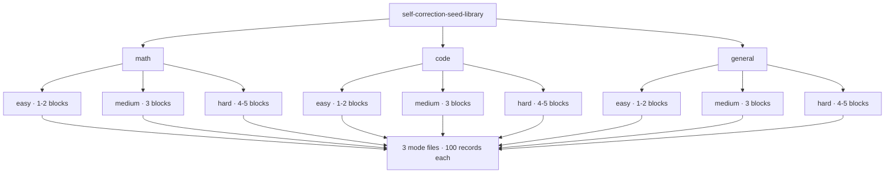

# Self Correction and Thinking

**A seed library for training language models to reason with self-correction.**


> Teaches three reasoning behaviors — catching your own errors, verifying correct answers, and rejecting false doubts — across three domains, three difficulty tiers, and three reasoning modes.

---

## The structure at a glance



Every leaf folder holds exactly three files — one per reasoning mode:

| File | Behavior pattern | What it teaches |
|------|------------------|-----------------|
| `wrong_then_fix.jsonl` | First attempt wrong → catch → fix → verify | You *can* be wrong, and a sanity check should catch it |
| `right_and_confirm.jsonl` | First attempt right → scrutinize → verify | Being right doesn't end the reasoning; proof matters |
| `right_doubt_reaffirm.jsonl` | First answer right → doubt with wrong alternative → reject the doubt | Second-guessing is itself fallible; don't manufacture errors |

---

## Stats

| Property | Value |
|----------|-------|
| Records | **2,700** |
| Files | **27** (one per domain × tier × mode) |
| Records per file | exactly **100** |
| Domains | `math`, `code`, `general` |
| Difficulty tiers | easy (1–2 blocks), medium (3 blocks), hard (4–5 blocks) |
| Reasoning modes | wrong-then-fix, right-and-confirm, right-doubt-reaffirm |
| System prompts | ~30% of records (persona only, never instruction-gated) |
| Format | JSONL — one JSON object per line |
| Validation | [`validate.py`](validate.py) — strict structural gate |

### Thinking depth scales with problem difficulty

| Tier | Mean reasoning | Mean final answer | Blocks |
|------|---------------:|------------------:|:-----:|
| Easy | ~51 words | ~4 words | 1–2 |
| Medium | ~168 words | ~35 words | 3 |
| Hard | ~552 words | ~96 words | 4–5 |

Easy problems get a quick check. Hard problems get multiple rounds of catching, fixing, and verifying. The model learns to match effort to complexity instead of padding trivial answers or truncating hard ones.

---

## The three reasoning modes

### `wrong_then_fix` — learning to catch your own errors

```json
{"messages": [
  {"role": "user", "content": "What is 7 x 8?"},
  {"role": "assistant", "content": "<think>\nFirst instinct: 54 (confused with 6x9).\n</think>\n\n<think>\nWait — 7x8 is 56, not 54. Seven eights are fifty-six.\n</think>\n\n56. I confused it with 6x9=54 initially."}
]}
```

A plausible mistake, a genuine catch, a corrected answer. This mode prevents overconfidence: even easy questions can be misread or misremembered.

### `right_and_confirm` — learning that verification isn't optional

The first answer is correct, then examined skeptically, then verified by a genuinely different method. This mode prevents lucky answers from standing unexamined.

### `right_doubt_reaffirm` — learning not to manufacture errors

The first answer is correct, then a tempting wrong second-guess appears, then the model recognizes the *doubt itself* was the error and the original answer stands. This mode prevents unnecessary self-doubt from leaking into final answers.

---

## Domains

- **[`math/`](math/README.md)** — arithmetic, algebra, probability, combinatorics, number theory, geometry, calculus, sequences and series, optimization, Fermi estimation. From "What is 5 + 5?" to "Does the harmonic series diverge?"
- **[`code/`](code/README.md)** — Python semantics, debugging, design patterns, algorithms, data structures, metaprogramming, concurrency, async. From `len("hello")` to descriptor protocols and the GIL.
- **[`general/`](general/README.md)** — science reasoning (Olbers' paradox, tidal locking, square-cube law), logic (syllogisms, fallacies, knights and knaves), reading comprehension, causal reasoning, grammar, ethics, history, planning. Everything that isn't code or math.

---

## Format specification

Each record is a chat-formatted JSON object (OpenAI messages style), one per line:

```json
{"messages": [
  {"role": "system", "content": "You are a careful mathematician."},
  {"role": "user", "content": "..."},
  {"role": "assistant", "content": "<think>\n…\n</think>\n\n<think>\n…\n</think>\n\n…final answer…"}
]}
```

The `system` message is present in ~30% of records and *never* instructs the reasoning behavior — persona only.

### Structural rules

1. **Only the final answer lives outside the tags.** No prose may sit between one `</think>` and the next `<think>`. A record that emits visible text between blocks teaches the model to break out of its reasoning mid-stream. This rule cannot be relaxed.
2. **Whitespace between blocks varies by file** (`\n`, `\n\n`, or `\n\n\n`) and is internally consistent within each file. Consumers should split on the tags, not the whitespace.
3. **Newlines inside content strings are JSON-escaped** (`\n`). Think tags are literal `<`/`>` characters. Files use Unix line endings.
4. **Block count matches the tier:** easy = 1–2, medium = 3, hard = 4–5.

---

## Design principles

1. **Reasoning is intrinsic, not instruction-gated.** No system prompt tells the model to reason, verify, or self-correct. Behavior is learned from examples, not instructions. This extends past commands to descriptions: "You are a careful mathematician who verifies results" is gated just as surely as "think step by step." System prompts carry a persona and nothing more.

2. **Thinking depth scales with difficulty.** Easy gets 1–2 blocks, medium gets 3, hard gets 4–5. The model learns to match effort to complexity.

3. **All three modes exist at all difficulty levels.** You can make careless errors on easy questions and be right on hard ones. No mode is confined to a single difficulty.

4. **Verification is always independent.** A math answer verified by formula is also checked by estimation or substitution. A code answer verified by tracing is also checked against docs, edge cases, or an equivalent one-liner.

5. **Final answers carry their reasoning.** Complex answers explain the method; trivial answers stay short. Explanation depth scales with difficulty.

---

## Validate

```bash
python validate.py
```

Exits non-zero on any structural violation: unbalanced tags, prose outside the tags, a block count that doesn't match the tier, an empty final answer, or a system prompt that instructs the reasoning.

It also reports soft observations that don't fail the run: duplicate prompts within a single file, and the most-repeated reasoning sentence per file (template risk). Watch that last one while writing — a closing sentence that repeats across a file becomes a habit the model reproduces verbatim.

**Shared prompts across modes are intentional.** The same question appearing in `right_and_confirm` and `wrong_then_fix` teaches that being right or wrong is not a property of the question. The requirement is that both trajectories reach the *same* final answer; divergent answers would be contradictory training data.

---

## Combine into a single dataset

```bash
find . -name "*.jsonl" | sort | xargs cat > combined.jsonl
```

Order doesn't matter — all files are independent.

---

## Documentation

| Page | Contents |
|------|----------|
| 🏠 This page | Overview, format, principles |
| ➕ [CONTRIBUTING.md](CONTRIBUTING.md) | How to add records: style rules, quality bar, validation gates |
| 📐 [Math domain](math/README.md) | Topic coverage, sample records, tier/mode links |
| 💻 [Code domain](code/README.md) | Topic coverage, sample records, tier/mode links |
| 🌍 [General domain](general/README.md) | Topic coverage, sample records, tier/mode links |

Difficulty pages: each tier folder (`easy/`, `medium/`, `hard/`) under every domain has its own README describing the tier's reasoning contract and showing a sample record per mode.

---

*Built for research into self-correction and reasoning. Every record is hand-written.*
