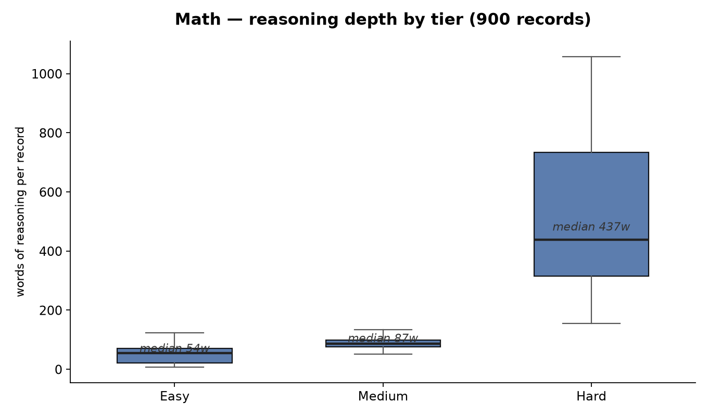

[🏠 Home](../README.md) / **Math**

# Math

Pure mathematics, ordered by depth. The easy tier is arithmetic you should get right but sometimes don't — multiplication-table confusions, rounding direction, misplaced decimal points. The medium tier is applied math where the wrong approach *feels* right: compound percentages on shifting bases, probability with confounders, inclusion–exclusion, simultaneous equations. The hard tier is mathematics where the answer is a proof, not a number — irrationality of constants, convergence debates, calculus identities, linear algebra counterfactuals, the independence of the continuum hypothesis. Math earns a dedicated domain because math errors are conceptual: a wrong formula, a wrong base, a theorem applied outside its scope. Every record here trains the model to name the assumption that led it astray, not just to recompute.

## In this folder

| Tier | Blocks | Records | Folder |
|------|:--:|:--:|------|
| Easy | 1–2 | 300 | [easy/](easy/README.md) |
| Medium | 3 | 300 | [medium/](medium/README.md) |
| Hard | 4–5 | 300 | [hard/](hard/README.md) |

900 records across 9 files, exactly 100 per file. Reasoning depth scales with tier: mean thinking length runs ~51 words at easy, ~168 at medium, and ~552 at hard; final answers run ~4, ~35, and ~96 words respectively. Roughly 30% of records carry a persona-only system prompt ("You are a mathematics tutor.") — never a reasoning instruction.

**Reasoning depth in this domain** — measured on the actual records, rendered by [`charts/generate_charts.py`](../charts/generate_charts.py):



## Reasoning modes in this domain

| File | Pattern |
|------|---------|
| `wrong_then_fix.jsonl` | First attempt wrong → catch the error → fix and verify |
| `right_and_confirm.jsonl` | First answer right → scrutinize → independently verify |
| `right_doubt_reaffirm.jsonl` | First answer right → doubt with wrong alternative → reject the doubt |

The same three files live at every tier — a careless error on "Is 51 prime?" and a five-round verification of an area integral are the same behavior at different depths. In this domain the modes map onto recognizable failure modes: wrong bases and forgotten divisibility rules (`wrong_then_fix`), verification by estimation, substitution, or a different unit (`right_and_confirm`), and tempting alternatives like "division always makes things smaller" or the empty product being 0 (`right_doubt_reaffirm`).

## A sample record from each mode

One record per mode, one tier per record — the progression from a two-block catch to a four-block doubt management is the point.

### `wrong_then_fix` — easy tier ([file](easy/wrong_then_fix.jsonl))

```json
{"messages": [{"role": "user", "content": "Is 51 prime?"}, {"role": "assistant", "content": "<think>\n51... it's odd, so not divisible by 2. Doesn't end in 0 or 5, so not divisible by 5 or 10. It doesn't look divisible by anything obvious. Yes, 51 is prime.\n</think>\n\n<think>\nWait, let me check divisibility by 3. Sum of digits: 5 + 1 = 6, which is divisible by 3. So 51 is divisible by 3: 51 / 3 = 17. That means 51 = 3 x 17, so it's not prime. I missed the divisibility rule for 3.\n</think>\n\nNo, 51 is not prime. 51 = 3 x 17."}]}
```

Two blocks: a plausible pattern-match ("nothing obvious divides it") caught the moment an actual divisibility check runs — and the catch names the skipped rule, not just "wait, wrong."

### `right_and_confirm` — medium tier ([file](medium/right_and_confirm.jsonl))

```json
{"messages": [{"role": "system", "content": "You are a helpful AI assistant."}, {"role": "user", "content": "A train travels at 90 mph for 2.5 hours. How far does it go?"}, {"role": "assistant", "content": "<think>\nDistance is speed times time: 90 x 2.5 = 225 miles.\n</think>\n<think>\nQuick magnitude check. 90 mph for 2 hours would be 180, for 3 hours would be 270. My answer of 225 sits between those, closer to 180, which matches 2.5 being closer to 2 than 3. Sensible.\n</think>\n<think>\nDifferent route: 2.5 hours is 150 minutes. At 90 mph that is 1.5 miles per minute. 150 x 1.5 = 225. Same figure via minutes.\n</think>\nThe train travels 225 miles. At 90 mph for 2.5 hours, the distance is 90 x 2.5 = 225."}]}
```

Three blocks: the first answer is right, a magnitude bracket stress-tests it, and the confirmation comes through a genuinely different route (minutes, not hours). Same-path recomputation would not count as verification.

### `right_doubt_reaffirm` — hard tier ([file](hard/right_doubt_reaffirm.jsonl))

```json
{"messages": [{"role": "user", "content": "Are there infinitely many twin primes?"}, {"role": "assistant", "content": "<think>\nTwin primes are pairs of primes differing by 2, like (3,5), (5,7), (11,13), (17,19). Are there infinitely many? The twin prime conjecture says yes, but it is unproven. This is one of the oldest open problems in number theory.\n</think>\n\n<think>\nBut we have partial results. Chen proved that there are infinitely many primes p such that p+2 is either prime or a semiprime (product of two primes). This is close to the twin prime conjecture but not identical. Also, Zhang proved in 2013 that there are infinitely many prime pairs with gap bounded by a constant (initially 70 million, later reduced to 246). These are strong partial results but not the full conjecture.\n</think>\n\n<think>\nLet me check the alternative: did someone prove it? The twin prime conjecture remains open as of 2024. The Zhang and Maynard results bound the gap, not prove that gap 2 occurs infinitely often. So the answer is: the twin prime conjecture is unproven \u2014 nobody has proved there are infinitely many twin primes.\n</think>\n\n<think>\nOne more check: could it be that twin primes become sparse and stop? The counting of twin primes up to x grows roughly like x / log\u00b2 x by a heuristic estimate, suggesting they continue but thin out. No proof has shown termination. The question is genuinely open.\n</think>\n\nNo, it is not known whether there are infinitely many twin primes. The twin prime conjecture remains unproven, though Chen showed infinitely many primes p such that p+2 is prime or semiprime, and Zhang showed infinitely many prime pairs with a bounded gap. Full twin prime infinitude is still open."}]}
```

Four blocks on a genuinely open problem. The tempting doubt — "did someone prove this recently?" — is rejected by checking what the partial results (Chen, Zhang, Maynard) actually establish. Hard-tier doubts get resolved against the state of the proofs, not gut feel.

## Topic coverage

- **Easy:** integer arithmetic, multiplication facts, simple percentages, fractions and decimals, place value and rounding, parity (is 0 even?), small-number primality, basic geometry facts, unit facts (minutes per hour, slices of a pizza).
- **Medium:** compound and reverse percentages, weighted averages, ratio and proportion, scale maps and unit conversion, motion and work problems, probability with cards/dice/marbles (with and without replacement), conditional probability, inclusion–exclusion, simultaneous equations, linear and quadratic solving, plane geometry (triangles, circles, clocks), order of operations, perfect numbers and divisor counts, Fermi estimation.
- **Hard:** proofs of irrationality and transcendence (e, √2, φ), series convergence debates (harmonic, alternating harmonic, p-series, Grandi's series), calculus (FTC, improper integrals, integration by parts, L'Hôpital's scope), linear algebra (determinants, eigenvalues, rank, independence, complex eigenvalues of real matrices), number theory (modular arithmetic, totients, Fermat primality witnesses, Chinese remainder problems, twin primes), probability theory (Bayes against a base rate, expectation, variance, distributions), optimization (fencing, boxes), combinatorics and counting, sequences and generating functions, transforms (Fourier, Laplace), real analysis edge cases, and foundations (the halting problem, the axiom of choice, continuum hypothesis independence, 0.999... = 1).

---

[🏠 Home](../README.md) · [Easy](easy/README.md) · [Medium](medium/README.md) · [Hard](hard/README.md)
