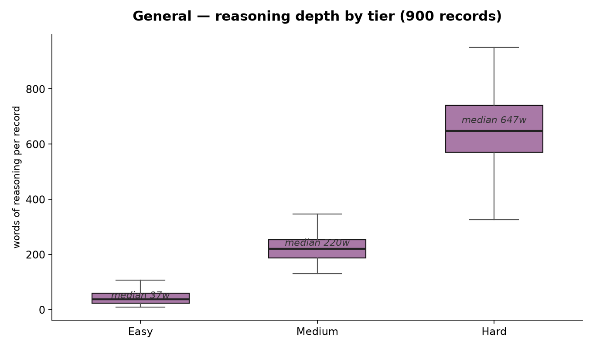

[🏠 Home](../../README.md) / **General**

# General

Everything that isn't code or math: science reasoning, logic and fallacies, reading comprehension, causal reasoning, grammar, ethics, history, planning, classification, strategic reasoning, risk assessment. The easy tier is general knowledge you should get right but sometimes don't — capitals recalled by fame instead of fact, spiders filed with insects, the sun said to orbit the earth because that's what the sky looks like. The medium tier is conceptual questions where the plausible answer outruns the true one: causal correlations with hidden confounders, litotes and double negatives, syllogism validity against a false premise, hypercorrected grammar, famous facts that are subtly wrong. The hard tier is reasoning where even knowledgeable people second-guess themselves — Olbers' paradox, tidal locking, mirror reversal, the square-cube law, the Ship of Theseus, the Gettier problem, Zeno, the Chinese Room. General earns a dedicated domain because these questions go wrong on *content* rather than *computation*: a plausible-sounding misconception, a hidden premise in an argument, a pronoun that could attach to two nouns, a correlation that looks causal. The three modes map directly onto that: catch yourself when you've answered confidently but wrong (`wrong_then_fix`), verify an answer against the actual passage or the actual physics (`right_and_confirm`), and refuse to second-guess a correct answer just because a tempting alternative exists (`right_doubt_reaffirm`).

## In this folder

| Tier | Blocks | Records | Folder |
|------|:--:|:--:|------|
| Easy | 1–2 | 300 | [easy/](easy/README.md) |
| Medium | 3 | 300 | [medium/](medium/README.md) |
| Hard | 4–5 | 300 | [hard/](hard/README.md) |

900 records across 9 files, exactly 100 per file. Reasoning depth scales with tier: mean thinking length runs ~51 words at easy, ~168 at medium, and ~552 at hard; final answers run ~4, ~35, and ~96 words respectively. Roughly 30% of records carry a persona-only system prompt ("You are a helpful assistant.") — never a reasoning instruction.

**Reasoning depth in this domain** — measured on the actual records, rendered by [`charts/generate_charts.py`](../../charts/generate_charts.py):



## Reasoning modes in this domain

| File | Pattern |
|------|---------|
| `wrong_then_fix.jsonl` | First attempt wrong → catch the error → fix and verify |
| `right_and_confirm.jsonl` | First answer right → scrutinize → independently verify |
| `right_doubt_reaffirm.jsonl` | First answer right → doubt with wrong alternative → reject the doubt |

The same three files live at every tier — a mistaken belief that Brazil speaks Spanish and a five-round defense of "correlation does not imply causation" are the same behavior at different depths. In this domain the modes map onto recognizable failure modes: confidently repeating a common myth, pattern-matching from a neighboring fact, or trusting a correlation because "correlated things are usually causes" (`wrong_then_fix`); verifying a correct answer against the actual passage, the actual grammar rule, or the actual physics by a genuinely different route — gender agreement resolved against sentence structure, a leap-year rule checked against 400-year arithmetic, buoyancy checked against how a balloon is actually piloted (`right_and_confirm`); and refusing a tempting doubt — "but don't Earth and sun orbit the barycenter?", "doesn't 'you and I' sound more formal?", "if correlation never implies causation, how do we know smoking causes cancer?" — when the doubt itself is the error (`right_doubt_reaffirm`).

## A sample record from each mode

One record per mode, one tier per record — the progression from a two-block catch to a five-block doubt management is the point.

### `wrong_then_fix` — easy tier ([file](easy/wrong_then_fix.jsonl))

```json
{"messages": [{"role": "user", "content": "What language is spoken in Brazil?"}, {"role": "assistant", "content": "<think>\nBrazil is in South America, and most of South America speaks Spanish. So the language spoken in Brazil is Spanish.\n</think>\n\n\n<think>\nWait, that's not right. Brazil was colonized by Portugal, not Spain. So the official language of Brazil is Portuguese, not Spanish.\n</think>\n\nPortuguese."}]}
```

Two blocks: a plausible association ("most of South America speaks Spanish") caught the moment the actual colonial history gets recalled — and the catch names the wrong association, not just "wait, wrong."

### `right_and_confirm` — medium tier ([file](medium/right_and_confirm.jsonl))

```json
{"messages": [{"role": "system", "content": "You are a helpful assistant."}, {"role": "user", "content": "Why do we have leap years?"}, {"role": "assistant", "content": "<think>\nA calendar year is 365 days, but that is a rounding. The Earth takes about 365.2422 days to orbit the sun once. Every year the calendar therefore finishes about a quarter of a day before the orbit does, and the calendar drifts ahead of the seasons.\n</think>\n\n<think>\nFour years of quarter-day shortfalls add to roughly one whole day, so inserting an extra day every fourth year absorbs the drift. That is the leap day. But a quarter is not exact: 0.2422 is slightly less than 0.25, so adding a full day every four years overcorrects by about 0.0078 days a year, roughly three days every four centuries. That is why century years are skipped unless divisible by 400, which removes three leap days per 400 years.\n</think>\n\n<think>\nCheck the correction against the residual. Over 400 years the simple rule adds 100 leap days; the refined rule adds 97. The true requirement is 400 x 0.2422 = 96.88 days. 97 is far closer to 96.88 than 100 is, so the exceptions are doing exactly the work the arithmetic says they should.\n</think>\nBecause a year is not a whole number of days. The Earth's orbit takes about 365.2422 days, so the calendar falls a quarter day behind each year, and a leap day every four years absorbs it. Century years are skipped unless divisible by 400, because a quarter is a slight overcorrection."}]}
```

Three blocks: the mechanism is right, the quarter-day rule is refined into the Gregorian century exceptions, and the confirmation is fresh arithmetic against the residual — 97 leap days per 400 years against the true 96.88 — not the same derivation restated.

### `right_doubt_reaffirm` — hard tier ([file](hard/right_doubt_reaffirm.jsonl))

```json
{"messages": [{"role": "user", "content": "Does correlation imply causation?"}, {"role": "assistant", "content": "<think>\nNo. Correlation is a statistical relationship between two variables; causation is a claim that intervening on one changes the other. Correlation can arise without causation in several distinct ways: a third variable causing both, reverse causation, selection effects in how the data was gathered, or coincidence across many tested hypotheses. So observing correlation does not license the causal claim.\n</think>\n<think>\nThe serious objection is that this slogan, taken literally, would make causal inference impossible outside randomised experiments, and that is plainly not how knowledge works. We know smoking causes lung cancer, and no one ran a randomised trial assigning people to smoke. We know asbestos causes mesothelioma. If correlation never carried causal weight, these conclusions would be unsupported, yet they are among the best established findings in medicine. So there must be something wrong with the flat denial.\n</think>\n<think>\nResolve that by looking at what actually justified the smoking conclusion, because it was not correlation alone. The evidence included a dose-response relationship, where more smoking meant more risk. It included temporal ordering, with exposure preceding disease. It included a biological mechanism, with identified carcinogens in smoke. It included consistency across many populations with different confounders. And it included the finding that quitting reduced risk, which is intervention-like evidence.\n</think>\n<think>\nSo the objection does not overturn the principle, it clarifies it. Correlation was necessary but never sufficient. What carried the conclusion was correlation combined with additional constraints that ruled out the alternative explanations one by one. That is a different claim from correlation implying causation, and it is exactly what the slogan is warning against skipping.\n</think>\n<think>\nCheck the refined position against a case where correlation was strong and the causal conclusion was wrong. Hormone replacement therapy correlated with reduced heart disease in large observational studies, and the effect was substantial and consistent. Randomised trials later found the opposite. The correlation came from healthier, wealthier women being more likely to receive the treatment. Strong, replicated correlation without the additional constraints produced a confidently wrong answer, which is precisely the failure the principle guards against. The original answer stands, with the clarification attached.\n</think>\nNo, it does not. Correlation can arise from a common cause, reverse causation, selection effects, or chance. This does not make causal inference impossible outside experiments, but it does mean correlation alone is never enough. Conclusions like smoking causing lung cancer rest on dose-response relationships, temporal ordering, known mechanisms, consistency across populations, and reduced risk after quitting. Where those additional constraints are missing, strong correlations have produced confidently wrong answers, as with hormone replacement therapy and heart disease."}]}
```

Five blocks on the statistical core of scientific reasoning. The tempting doubt — "denying correlation would make causal inference impossible outside randomized trials" — is rejected by examining what actually carried the smoking conclusion (dose-response, temporal order, mechanism, consistency, quitting), then stress-tested against hormone replacement therapy, where strong correlation produced a confidently wrong causal claim. Hard-tier reaffirmation runs on mechanisms and evidence, not reassurance.

## Topic coverage

- **Easy:** common-knowledge questions where the wrong answer is a common myth or surface association — capitals and largest-things geography (Sydney vs Canberra, the Pacific), astronomy basics (the sun does not orbit Earth, the moon makes no light of its own, Pluto's demotion), everyday physics (a kilogram of feathers vs steel, ice floating on water), classification basics (spiders are not insects, tomatoes as fruit, whales as mammals), simple definitions and expansions (CPU, HTML), language facts (Brazil speaks Portuguese, the past tense of "go", "their" is not a contraction), spelling and counting checks ("January" has 7 letters), and fact staples that just need care (the Great Wall is in China, Antarctica is a desert, 0°C is freezing).
- **Medium:** conceptual questions where the plausible answer outruns the true one — causal correlations with hidden confounders (ice cream and drowning, sugar and hyperactivity), Simpson's paradox, syllogism validity against soundness (flying penguins, hairy whales), reading comprehension (pronoun resolution over short passages, quantifier scope, litotes and double negatives like "not insignificant"), grammar hypercorrections and confusables (between you and I/me, affect/effect, less/fewer, its/it's, subject-verb agreement with collective nouns, "data" as plural vs mass noun), misconception science (10% of the brain, goldfish memory, Coriolis in sinks, seasons as distance from the sun, glass as a slow-flowing liquid, blue veins, mitochondria, Lamarck), fact-checking staples (Napoleon's height, Edison's light bulb, the Great Wall from space), ethics (the trolley switch, the harm principle, white lies), history (the Declaration of Independence, WWI causes), geography with depth (Russia spanning Europe and Asia, Antarctica as a desert), and planning (scheduling with constraints, critical path).
- **Hard:** questions where even knowledgeable people second-guess themselves — probability puzzles (Monty Hall, the birthday paradox, the gambler's fallacy, the metre of slack around the equator), knights-and-knaves logic grids, deep science explanations (Olbers' paradox, tidal locking and the moon's single face, why mirrors swap left and right but not up and down, the square-cube law and the limits of animal size, Earth's core composition inferred from seismology, Rayleigh scattering and the blue sky, hot water freezing faster than cold), physics meets intuition (quantum entanglement vs faster-than-light communication), the philosophy chestnuts (the Ship of Theseus, the Gettier problem, moral luck, Zeno's paradoxes, the lazy argument, the Chinese Room, trolley-problem variants), causal architecture at scale (climate attribution, evolution vs Lamarck after epigenetics), historical explanation (the fall of Rome, WWI causes), and multi-constraint planning and scheduling.

---

[🏠 Home](../../README.md) · [Easy](easy/README.md) · [Medium](medium/README.md) · [Hard](hard/README.md)
